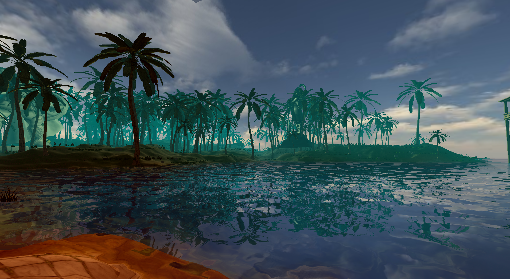
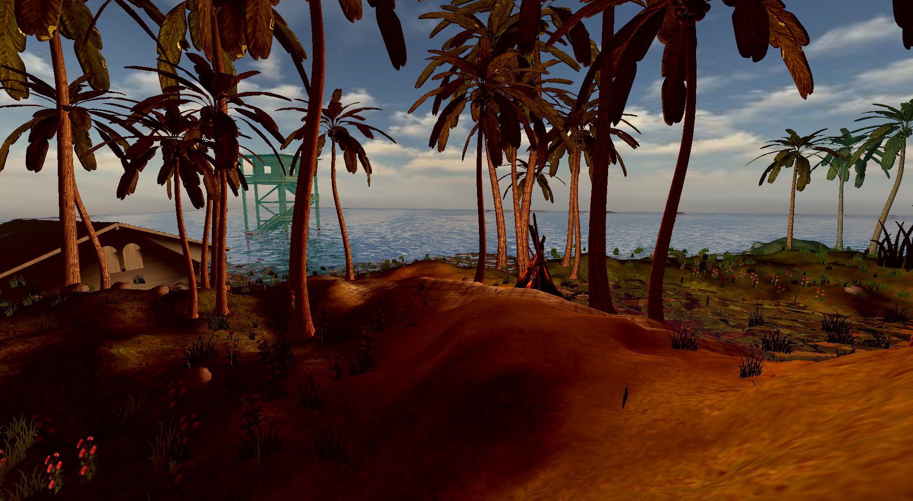

# GEngine-3D
    Simple OpenGL 3D engine using JLWGL

readmePictures

 

## Implemented features:

  * Terrain Collision
  * Water Reflection AND Refraction
  * Simple underwater effects(slow, blue hue)
  * HeightMap Terrain Generation
  * Multi-texturing
  * Mip mapping
  * Backface culling
  * Simple OBJ loader
  * Z-buffer
  * Player (FP and 3rdP)
  * Random object spawn

## To be implemented:
  * Water waves
  * Water collision
  * Shadow shader
  * Skybox
  * OBJ Collision
  * Particle Shader
  * Networking?
